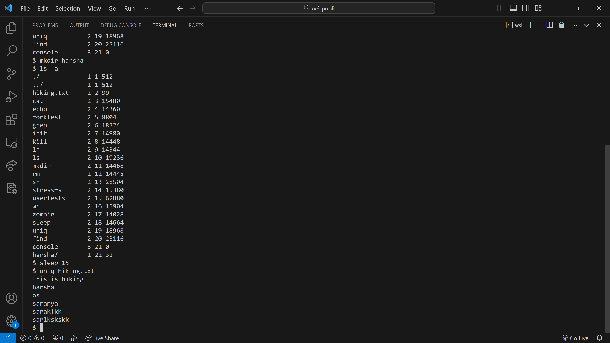

## System Environment

### Device specifications
1. Device name:-	Hiking
2. Processor:-	Intel(R) Core(TM) i7-8550U CPU @ 1.80GHz   1.99 GHz
3. Installed RAM:-	16.0 GB (15.8 GB usable)
4. Device ID:-	34A72DF6-2318-4A73-9B27-B0E4BFFC2F73
5. Product ID:-	00325-81104-61077-AAOEM
6. System type:-	64-bit operating system, x64-based processor
7. Pen and touch:-	Pen and touch support with 10 touch points

### Windows specifications
1. Edition:-	Windows 11 Home
2. Version:-	22H2
3. Installed on:-	‎10/‎18/‎2023
4. OS build:-	22621.3007
5. Serial number:-	PF1EGKFN
6. Experience:-	Windows Feature Experience Pack 1000.22681.1000.0

## Group members
1. Venkata Saranya Kolapalli (U85920523)
2. Harshavardhan Guntreddi (U71205159)
3. Dileep Reddy Kallem (U26404722)

### Steps to Run the code
1. open visual studio code
2. navigate to xv6-public folder through terminal or open the xv6-public folder using open folder option.
3. open wsl in the terminal and run make clean, make  and make qemu-nox commands.

### make clean


### make


### make qemu-nox


##  Implementation of commands
### Modifying ls 
To automatically hide hidden files and directories we modified the ls and ls_a functions in ls.c by adding the following if statement.  
```
if (fmtname(buf)[0] == '.'){
        continue;
      }
``` 


We added a "/" at the end of the directory by calling a new function (fmtname_dir) when we encounter a directory by using type in struct stat which is named 'st' in ls.c.
```
if (st.type == 1){
        printf(1, "%s %d %d %d\n", fmtname_dir(buf), st.type, st.ino, st.size);
      }
else {
        printf(1, "%s %d %d %d\n", fmtname(buf), st.type, st.ino, st.size);
      }
```
In the new function we added a "/" at the end of the directory name using pre-existing memset function.
```
int k = strlen(p);
  memset(p+k, '/', 1);int k = strlen(p);
  memset(p+k, '/', 1);
```
we achevied printing the hidden files and directories when using a "-a" flag by using the strcmp function to check if the second arguement (argv[1]) is "-a" or not.

```
for(i=1; i<argc; i++)
    if (strcmp((argv[1]), "-a") == 0){
      if (i+1 < argc){
      ls_a(argv[i+1]);
      i += 1;
      }
      else{
        ls_a(".");
      }
    }
    else {
    ls(argv[i]);
    }
```
 If it is "-a" we will call the ls_a function which is the unmodified version we had, before adding the following if statement to print the hidden files and directories.

 ```
 if (fmtname(buf)[0] == '.'){
        continue;
      }
 ```


 ### Implementing the sleep command
 we handled the situation when user does not specify the time using the following if statement.
 ```
 if (argc < 2){
        printf(2,RED "Error : No time specified\n" RESET);
        exit();
    }
 ```
we are using the following while loop to check if the given string has non-numerical characters or not. If the character is non-numeric and not a decimal then it prints that the input is invalid and invokes the exit call. If the condition is not satisfied the loop then proceeds to check the next character in the string.

 ```
 char *hiking = argv[1];
    while (*hiking){
        if ((*hiking < '0' || *hiking > '9') && (*hiking != '.')){
            printf(2, RED "Error : Invalid input\n" RESET);
            exit();
        }
        hiking++;
    }
 ```
If all the characters are numeric with the exception of a decimanl point then we convert the string into a integer using the atoi function. we are multiplying the input with 100(approximately converting ticks into seconds) so that we can perceive the time when the system stalls when the system call is invoked and proceeds to exit.

```
sleep_time = atoi(argv[1]);
sleep(sleep_time*100);
```

We have added sleep program to UPROGS in Makefile inorder to compile it with the other files when we use the command make qemu-nox.
```
UPROGS=\
	_cat\
	_echo\
	_forktest\
	_grep\
	_init\
	_kill\
	_ln\
	_ls\
	_mkdir\
	_rm\
	_sh\
	_stressfs\
	_usertests\
	_wc\
	_zombie\
	_sleep\
	_uniq\
    _find\
```


### Implementing the uniq command
If we have any problem opening the given file we print an error statement.
```
if((fd=open(file_name,0))<0){
  printf(2,"cannot open %s\n",file_name);
  exit();
}
```
To remove duplicate lines we compare the previous line and the current line using strncmp function which returns 1 if they are same else 0.



The strncmp function first checks if a random integer stored in num with the lenghts of the previous line and the current line to get the minimum which is used to compare the lines. Then we proceed to compare the characters in the both lines by running them through the for loop (number of iterations = num). 
```
int strncmp(char *curr_line,char *prev_line,int N){
int num=N;
if(strlen(prev_line)==0)
return 1;
if(num>strlen(curr_line))
num=strlen(curr_line);
if(num>strlen(prev_line))
num=strlen(prev_line);
for(int i=0;i<num;i++){
if(curr_line[i]!=prev_line[i])
return 1;
}
return 0;
}
```
If the line is not same as the previous line then we check for  flags to print the line accordingly and store the count if it is a duplicate of another line in a variable 'count'. If we have a '-c' flag then we increase the counter each time we get a duplicate line and set the counter to 0 if we encounter a unique line. If we have a '-u' flag then we check if the line is unique (count = 1) and then print the line. 
```
if(strncmp(curr_line,prev_line,num)!=0){
  	    if(cFlag==0 && uFlag==0 && wFlag==0){
  	      printf(2,"%s",curr_line);}
  	    else if(cFlag!=0 && strcmp(prev_line,"")!=0){
  	      printf(2,"%d %s",count,prev_line);
  	      count=0;
  	    }
  	    else if(uFlag!=0){
  	    //printf(2,"Count VAlue:%d\n",count);
  	      if(strcmp(prev_line,"")!=0 && count==1)
  	      {
  	    	printf(2,"%s",prev_line);
  	    	
  	      }
  	      count=0;
  	    
  	    }
  	    else if(wFlag!=0){
  	    //count=0;
  	    //if(count==0){
  	    //strcpy(wflag_line,);
  	    printf(2,"%s",curr_line);
  	    //}
  	    
  	    //count=0;
  	    }
  	    
  	  }
  	  
  	  
  	  strcpy(prev_line,curr_line);
  	  j=0;
  	  count+=1;
```


If we have a '-w' flag we store the number of characters we need to compare into wFLag when parsing the command input and later store it into num. we compare the required number of characters using the strncmp function which compares the number of characters which is a minimum of num, length of current and previous lines.
```
int num=wFlag;
```
```
int strncmp(char *curr_line,char *prev_line,int N){
int num=N;
if(strlen(prev_line)==0)
return 1;
if(num>strlen(curr_line))
num=strlen(curr_line);
if(num>strlen(prev_line))
num=strlen(prev_line);
for(int i=0;i<num;i++){
if(curr_line[i]!=prev_line[i])
return 1;
}
return 0;
}
```


To handle '|' operator (cat hiking.txt | uniq)we gave the default value of 'fd' as 0 when there is no filename it remains unchanged and it there is a file name we store it in 'fd'. If there is no filename then 'fd' remains unchanged which enables us to get the input from stdin (cat command writes the output onto stdout)
```
if(strcmp(file_name,"")!=0){
  if((fd=open(file_name,0))<0){
  printf(2,"cannot open %s\n",file_name);
  exit();
  }
  }
  while((n=read(fd,line,sizeof(line)))>0)
```


We have added uniq program to UPROGS in Makefile inorder to compile it with the other files when we use the command make qemu-nox.
```
UPROGS=\
	_cat\
	_echo\
	_forktest\
	_grep\
	_init\
	_kill\
	_ln\
	_ls\
	_mkdir\
	_rm\
	_sh\
	_stressfs\
	_usertests\
	_wc\
	_zombie\
	_sleep\
	_uniq\
    _find\
```


### Implementing the find command

To Implement we developed 4 functions main, verify, cus_print and find.


1. Verify - takes the string as input and verify if the string is `-name , -type , -inum or -printi` then it returns 0 else it return 1
    ```
    if(strcmp(str,"-name")==0 ||
        strcmp(str,"-type")==0 ||
        strcmp(str,"-inum")==0 ||
        strcmp(str,"-printi")==0 )
            return 0;
        else
            return 1;
    ```

2. cus_print - custom print, if user gives -printi as argument, it prints inode value and content in buffer else it prints buffer.

    ```
    if(printi_bool)
        {
            printf(1,"%d \t %s\n",inum,buf);
        }
        else
        {
            printf(1,"%s\n",buf);
        }
    ```
3. Main - main file where we read the command and set the variables for name, type, inum and printi

    First we are checking the number of arguments are less than  2 or not, if there are less than two arguments then we call find function with current directory and empty strings (name, type, inum)

    else if there are more than or equal two arguments we have to check whether second argument  is folder name or not by calling `verify` function. After that we have to iterate through remaining command and set the variables based on string given after the tag. Call the find function with all the variables(folder,name,type,inum,printi_bool).


4. Find - Find function is the advance version of ls here we are calling the same function recursively for every directory. Based on the arguements passed to it, that execute the snippet and prints the requires data. To print the results, we have to call cus_print with arguments. It checks boolean value `printi_bool` if it set 1 then prints inode value and content in buf else only buf


