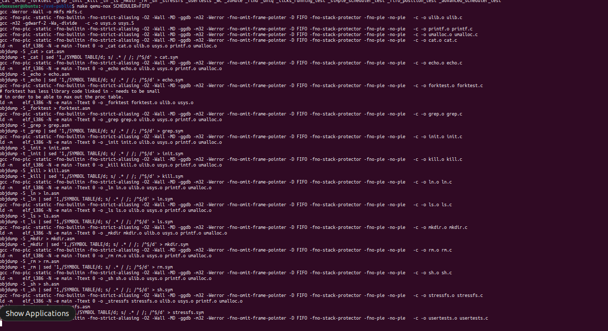

## System Environment

### Device specifications
1. Device name: SamsungBook
2. Processor: 12th Gen Intel(R) Core(TM) i7-1255U   1.70 GHz
3. Installed RAM: 16.0 GB (15.7 GB usable)
4. Device ID: D53CF7E1-361B-46C3-B779-9D38E391C29A
5. Product ID: 00342-22069-46723-AAOEM
6. System type: 64-bit operating system, x64-based processor
7. Pen and touch: Pen and touch support with 10 touch points

### Windows specifications
1. Edition: Windows 11 Home
2. Version: 22H2
3. Installed on: ‎1/‎9/‎2023
4. OS build: 22621.3007
5. Serial number: 5LD09FGTA05265W
6. Experience: Windows Feature Experience Pack 1000.22681.1000.0

## Group members (same group members)
1. Venkata Saranya Kolapalli (U85920523)
2. Harshavardhan Guntreddi (U71205159)
3. Dileep Reddy Kallem (U26404722)

### Steps to Run the code
1. open visual studio code
2. navigate to xv6-public folder through terminal or open the xv6-public folder using open folder option.
3. open wsl in the terminal and run make clean, make, commands. 
4. The commands for default scheduler: make qemu-nox/ make qemu-nox SCHEDULER
                    simple scheduler(FIFO): make qemu-nox SCHEDULER=FIFO
                    advanced scheduler(PRIORIY): make qemu-nox SCHEDULER=PRIORITY

### make clean


### make 


### make qemu-nox


### make qemu-nox SCHEDULER


### make qemu-nox SCHEDULER=FIFO




### make qemu-nox SCHEDULER=PRIORITY


## Procedure for adding system call 
1. we needed to define the system call in syscall.h. 
```
#define SYS_set_sched_priority 22
#define SYS_get_sched_priority 23
```
2. we added a function pointer in the syscall.c.
```
[SYS_set_sched_priority] sys_set_sched_priority,
[SYS_get_sched_priority] sys_get_sched_priority,
```
3. we added a function prototype in syscall.c.
```
extern int sys_set_sched_priority(void);
extern int sys_get_sched_priority(void);
```
4. we added the following line to usys.S so that user can access the system call from the user program.
```
SYSCALL(set_sched_priority)
SYSCALL(get_sched_priority)
```
5. we added the function that the user program will be calling to user.h.
```
int set_sched_priority(int);
int get_sched_priority(int);
```
6. The main function is added in the proc.c file.

```
The code snippets above are just there to explain the procedure to add the system call they may not be the actual calls we used
```


##  Implementation
### Adding ticks_running()
#### system call
we have added a functionality for tracking how many ticks each process is running using a system call ticks_running(pid) that returns the number of ticks a process had run for the given pid. we acquire the ptable lock to browse through the table to find the process with the pid and the release the lock when we find it and then return the ticks. 
```
acquire(&ptable.lock);
  for(p = ptable.proc; p < &ptable.proc[NPROC]; p++){
    if(p->pid == pid){
      release(&ptable.lock);
      return p->ticks;
    }
  }
```

If we don't find the process then we release the loop after the loop and then check if process exists and hasn't been scheduled yet then we return 0. If the process doesn't exist the funciton returns -1.

```
release(&ptable.lock);
  if (pid > 0)
    return -1; // Process with given pid does not exist
  else
    return 0; // Process exists, but hasn't been scheduled yet
```

Refer to the section named "Adding system call" for the procedure we followed to add a system call.

#### user program
we wrote a user program (ticks_test.c) to test the ticks_running(pid) system call.
we did the error handling and getting the input from stdin using the following lines. In the case that there is no input (pid) from the user we use the getpid() call to get the pid of the caller function so that we will use that to find the ticks. The user program prints the ticks of the process and then exits using the exit() call.
```

  int pid=9999;
  if(argc>2){
    printf(1,"Too Many Arguments");
    exit();
  }
  if(argc<2)
  {
     pid = getpid();
  }
  else{
    pid=atoi(argv[1]);
  }
  int ticks = ticks_running(pid); 
    printf(1, "Ticks running for process %d: %d\n", pid, ticks);
```
we used the commented code to test the required cases in the project description.
```
    /*int non_existent_pid = 9999; 
    ticks = ticks_running(non_existent_pid);
    if (ticks == -1)
        printf(1, "Process with PID %d does not exist\n", non_existent_pid);
    else
        printf(1, "Ticks running for process %d: %d\n", non_existent_pid, ticks);

    // Test with a process ID that exists but hasn't been scheduled yet
    int new_process_pid = fork();
    sleep(10);
    if (new_process_pid == 0) {
        // Child process
        
        exit();
    } else if (new_process_pid > 0) {
        
        ticks = ticks_running(new_process_pid);
        printf(1, "Ticks running for process %d: %d\n", new_process_pid, ticks);
        wait();
    }*/

    exit();
```


1. Correctly returns the time scheduled for the calling process (with pid returned by getpid()). 


2. Correctly returns the time scheduled for any process id.


3. Correctly returns -1 for a process that does not exist.


### Implementing simple scheduler (FIFO)
we implemeted the logic for the FIFO (first in first out) in the scheduler funciton in proc.c. 
first step is to acquire the lock for the ptable to find if the process state is runnable and then goes into the scheduler that we are using, i.e. in this case FIFO (there is a default scheduler and a priority scheduler as well). 

```
acquire(&ptable.lock);
    for(p = ptable.proc; p < &ptable.proc[NPROC]; p++){
    #ifdef DEFAULT
      	if(p->state != RUNNABLE)
          continue;
      #else
      #ifdef FIFO
``` 

we check if the process is runnable.

```
 #ifdef FIFO
       
      	struct proc *mp = 0;

            if(p->state != RUNNABLE)
              continue;
```

 we ingnore the init and sh processes using a if condition by making sure pid is greater than 1. Then we use a nested if statement to check if the processs with the least start time is 0 (mp) then we assign the process p to mp (process that first came in will be saved here after we go through our logic). If mp is not 0 then we compare the creation time (ctime) of the process p with the mp and we save the process with least ctime (creation time) in mp. We then proceed to check if the process in mp is not 0 and it's state is RUNNABLE then we store it in p.

 ```
   // ignore init and sh processes from FCFS
            if(p->pid > 1)
            {
              if (mp != 0){
                // here I find the process with the lowest creation time (the first one that was created)
                if(p->ctime < mp->ctime)
                  mp = p;
              }
              else
                  mp = p;
            }
            if(mp != 0 && mp->state == RUNNABLE)
                p = mp;

```

After getting the process with the least creation time stored in p then we start the switch. we store p as current process (c->proc). we assign the start time of a process using p->stime = ticks. Then we swith the process and change its state to RUNNING. we increment ticks each time a process is scheduled and when the process is done we change the c->proc to 0 and then release the ptable lock once we are out of the loop.

```
// Switch to chosen process.  It is the process's job
      // to release ptable.lock and then reacquire it
      // before jumping back to us.
      c->proc = p;
      p->stime=ticks;
      switchuvm(p);
      p->state = RUNNING;
       p->ticks++; // Increment ticks when process is scheduled

      swtch(&(c->scheduler), p->context);
      switchkvm();

      // Process is done running for now.
      // It should have changed its p->state before coming back.
      c->proc = 0;
    }
    release(&ptable.lock);
```

#### user program
we used a simple_scheduler_test.c program to test the schedulers. we create multiple child processes and use exec() to run them and make the parent wait until the child runs till completion. we used the sleep call to assist us in testing the schedueler.

```
for (int i = 0; i < 4; i++) {
        sleep(5);
        int child_pid = fork();
        if (child_pid < 0) {
            printf(1, "Fork failed\n");
            exit();
        } else if (child_pid == 0) {
            // Child process
            //int child_pid = getpid();
            sleep(10);
            exec(params[0],params);
            // Do any child-specific tasks here
            
            exit();
        }
        /*else{
        wait();
        }*/
    }

    // Parent process
    // Do any parent-specific tasks here
    for (int i = 0; i < 4; i++) {
        wait(); // Wait for each child process to finish
    }
    exit();
```


#### Adding system call (fifo_position(pid))
We have used the procedure in the section named Procedure for adding system call to add fifo_position(pid). we acquire the ptable lock and browse through the ptable to find the required process. we keep a temporary variable count and we will increment it in every iteration. When we find the process (p->pid == pid) then we store count into position and we return it.

```
acquire(&ptable.lock);
  int position = -1;
  int count = 0;
  for(p = ptable.proc; p < &ptable.proc[NPROC]; p++){
    if(p->state == RUNNABLE || p->state == RUNNING){
      count++;
      if(p->pid == pid){
        position = count;
        break;
      }
    }
  }
  release(&ptable.lock);
  return position;
}
```

#### user program (for testing the fifo_position(pid) call)
we used fifo_position_test.c to test if the fifo_position(pid) is working or not.

we did the error handling and getting the input from stdin using the following lines. In the case that there is no input (pid) from the user we use the getpid() call to get the pid of the caller function so that we will use that to find the position. The user program prints the position of the process and then exits using the exit() call.

```
 if(argc>2)
    {
    printf(1,"Too Many Arguments");
    exit();
    }
    if(argc<2){
    pid=getpid(); 
    }
    else{
    pid=atoi(argv[1]);
    }
    int position = fifo_position(pid);
    if (position == -1)
        printf(1, "Process with PID %d does not exist or is not in the scheduling queue.\n", pid);
    else
        printf(1, "Position of process with PID %d in the FIFO queue: %d\n", pid, position);

    exit();
}
```


### Implementing the Advanced scheduler (PRIORITY)
we implemeted the logic for the PRIORITY in the scheduler funciton in proc.c. 
first step is to acquire the lock for the ptable to find if the process state is runnable and then goes into the scheduler that we are using, i.e. in this case PRIORITY (there is a default scheduler and a FIFO scheduler as well).

```
acquire(&ptable.lock);
    for(p = ptable.proc; p < &ptable.proc[NPROC]; p++){
    #ifdef DEFAULT
      	if(p->state != RUNNABLE)
          continue;
      #else
      #ifdef FIFO

      #else
      #ifdef PRIORITY
```

we check if the process is runnable.

```
#ifdef PRIORITY
      struct proc *hp=0;
      if(p->state != RUNNABLE)
              continue;
```

we assign the priority to a child created using a command in shell using the following code in fork1() fucntion in sh.c.

```
pid = fork();
  if (pid == 0){
    int priority = 2;
    int ppid = getpid();
    // printf(2,"%d\n",ppid);
    priority = (ppid+2)%3;
    set_sched_priority(priority);
  }
```

If the high priority process (hp) is 0 then we store p in hp. If there is a process in hp then we compare the priorities of hp and p (hp->pl > p->pl). We considered process with low pl (priority level) value to have the high priority and stored it in hp. If the process had the same priority then we compare the creation time (ctime) and we store the process with the least ctime in hp. After we check the priorities then we store the process in p in hp.

```
if (hp == 0){
        hp = p;
      }
      else{
        if(hp->pl > p->pl){
          hp = p;
        }
        else if(hp->pl == p->pl && hp->ctime > p->ctime){
						hp = p;
        }
        //else
        //hp=p;

      }
      p = hp;
```

After getting the process with the highest priority (least pl) stored in p then we start the switch. we store p as current process (c->proc). we assign the start time of a process using p->stime = ticks. Then we swith the process and change its state to RUNNING. we increment ticks each time a process is scheduled and when the process is done we change the c->proc to 0 and then release the ptable lock once we are out of the loop.

```
// Switch to chosen process.  It is the process's job
      // to release ptable.lock and then reacquire it
      // before jumping back to us.
      c->proc = p;
      p->stime=ticks;
      switchuvm(p);
      p->state = RUNNING;
       p->ticks++; // Increment ticks when process is scheduled

      swtch(&(c->scheduler), p->context);
      switchkvm();

      // Process is done running for now.
      // It should have changed its p->state before coming back.
      c->proc = 0;
    }
    release(&ptable.lock);
```

#### user program
we used a advanced_scheduler_test.c program to test the schedulers. we create multiple child processes and use exec() to run them and make the parent wait until the child runs till completion. we set the priority of the child processes using set_sched_priority() system call. we used the sleep call to assist us in testing the schedueler.

```
for (int i = 0; i < 4; i++) {
        sleep(5);
        int child_pid = fork();
          
        if (child_pid < 0) {
            printf(1, "Fork failed\n");
            exit();
        } else if (child_pid == 0) {
            // Child process
            
            sleep(10);
            int child_pid = getpid();
            set_sched_priority((i+2)%3);
            printf(1,"Running Child Process pid = %d\n",child_pid);
            //exec(params[0],params);
            
            // Do any child-specific tasks here
            
            exit();
        }
        /*else{
        wait();
        }*/
    }

    // Parent process
    // Do any parent-specific tasks here
    for (int i = 0; i < 4; i++) {
        wait(); // Wait for each child process to finish
    }
    exit();
}
```


#### Adding system call (set_sched_priority(priority))
We have used the procedure in the section named Procedure for adding system call to add set_sched_priority(). we get the input using 
```
if(argint(0, &pl) < 0)
    return -1;
```
we get the process using myproc() and assign the priority to the process.
```
struct proc *p;
    int pl;
    if(argint(0, &pl) < 0)
    return -1;
    p = myproc();
    p->pl = pl;
```


#### Adding system call (get_sched_priority(priority))
We have used the procedure in the section named Procedure for adding system call to add get_sched_priority(). we get the input using 
```
if(argint(0, &pid) < 0)
    return -1;
```

we acquire the ptable lock and browse through the ptable to find the required process. we check if the process state is RUNNABLE or RUNNING and then store the pl (priority) in res (temp variable). Then we release ptable lock and return res and if we do not find any process we return res with default value (-1). 

```
acquire(&ptable.lock);
    for(p=ptable.proc; p<&ptable.proc[NPROC]; p++)
    {
        if(p->pid == pid && (p->state == RUNNABLE  || p->state == RUNNING))
        {
            res = p->pl;
            // cprintf("res : %d",res);
            release(&ptable.lock);
            return res;
        }
    }
    release(&ptable.lock);
// cprintf("hiking\n");
return res;
```


#### user program (h_get_priority())

we get the pid from stdin and convert to int using atoi. We get the priority using the get_sched_priority system call. 

```
 if (argc < 2){
        printf(2,RED "Error: No pid specified\n" RESET);
        exit();
    }
    pid = atoi(argv[1]);
    priority = get_sched_priority(pid);
    printf(2,"priority : %d\n", priority);
    exit();
```


## changes to makefile
to add the schedueler tags

```
ifndef SCHEDULER
SCHEDULER:=DEFAULT
endif
```
```
CFLAGS = -fno-pic -static -fno-builtin -fno-strict-aliasing -O2 -Wall -MD -ggdb -m32 -Werror -fno-omit-frame-pointer -D $(SCHEDULER)
```

added to UPROGS

```
UPROGS=\
	_cat\
	_echo\
	_forktest\
	_grep\
	_init\
	_kill\
	_ln\
	_ls\
	_mkdir\
	_rm\
	_sh\
	_stressfs\
	_usertests\
	_wc\
	_zombie\
	_find\
	_uniq\
	_sleep\
	_ticks_running_test\
	_simple_scheduler_test\
	_fifo_position_test\
	_advanced_scheduler_test\
	_h_get_priority\
```

added to extras

```
EXTRA=\
	mkfs.c ulib.c user.h cat.c echo.c forktest.c grep.c kill.c find.c uniq.c sleep.c ticks_running_test.c\
	ln.c ls.c mkdir.c rm.c stressfs.c usertests.c wc.c zombie.c simple_scheduler_test.c\
	printf.c umalloc.c fifo_position_test.c advanced_scheduler_test.c h_get_priority.c\
	README dot-bochsrc .pl toc. runoff runoff1 runoff.list\
	.gdbinit.tmpl gdbutil\
```

## changes to the pcb in proc.h

added these tto struct proc.

```
char name[25];               // Process name (debugging)
  int ctime;			//Creation Time
  int ticks;			//Running Ticks
  int pl;                      //priority level
  int stime;			//Process Start Time
  int etime;			//Process End Time
```

## Note:
#### stressfs in not working after using it for certain number of times. It enters into panic mode saying out of blocks.


