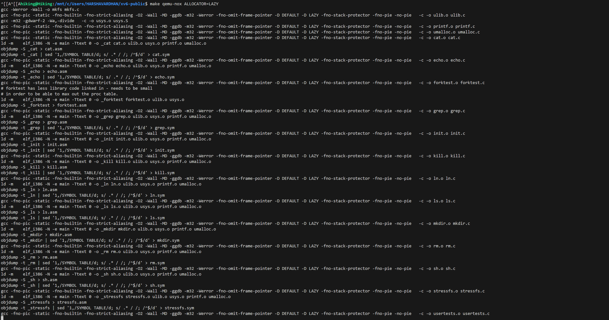

## System Environment

### Device specifications
1. Device name:-	Hiking
2. Processor:-	Intel(R) Core(TM) i7-8550U CPU @ 1.80GHz   1.99 GHz
3. Installed RAM:-	16.0 GB (15.8 GB usable)
4. Device ID:-	34A72DF6-2318-4A73-9B27-B0E4BFFC2F73
5. Product ID:-	00325-81104-61077-AAOEM
6. System type:-	64-bit operating system, x64-based processor
7. Pen and touch:-	Pen and touch support with 10 touch points

### Windows specifications
1. Edition:-	Windows 11 Home
2. Version:-	22H2
3. Installed on:-	‎10/‎18/‎2023
4. OS build:-	22621.3007
5. Serial number:-	PF1EGKFN
6. Experience:-	Windows Feature Experience Pack 1000.22681.1000.0

### Group members (same group members)
1. Venkata Saranya Kolapalli (U85920523)
2. Harshavardhan Guntreddi (U71205159)
3. Dileep Reddy Kallem (U26404722)

### Steps to Run the code
1. open visual studio code
2. navigate to xv6-public folder through terminal or open the xv6-public folder using open folder option.
3. open wsl in the terminal and run make clean, make  and make qemu-nox commands.
4. The commands for default allocator: make qemu-nox/ make qemu-nox ALLOCATOR
5. The command for LAZY allocator: make qemu-nox ALLOCATOR=LAZY
6. The command for LOCALITY allocator: make qemu-nox ALLOCATOR=LOCALITY

### make clean


### make


### make qemu-nox


### make qemu-nox ALLOCATOR


### make qemu-nox ALLOCATOR=LAZY




### make qemu-nox ALLOCATOR=LOCALITY


## PART 1
### After deleting page allocation in sbrk(n) in sysproc.c
To delete the page allocation we commented the function call that increments the size of the process and allocates memory. 

```
int
sys_sbrk(void)
{
  int addr;
  int n;

  if(argint(0, &n) < 0)
    return -1;
  addr = myproc()->sz;
  myproc()->sz += n;
  // if(growproc(n) < 0)
  //   return -1;
  return addr;
}
```


### Implementation of page allocation in xv6
when a page wants to have extra space allocated and it calls malloc, first it checks if it has any free pages available and if there aren't free pages then the functions uses a system call sbrk() to request the pages.

#### sbrk()  (sysproc.c)
sbrk() function get the value n from the user space and expands the heap size by 'n' using growproc() to facilitate the allocation of new memory requested. The funciton calls growproc() to allocate memory for the freshly allocated space of the process. sbrk() can increase and decrease the space of the process depending on n (if n is positive then it increases the size and if it is negative then it decreases it).

```
int
sys_sbrk(void)
{
  int addr;
  int n;

  if(argint(0, &n) < 0)
    return -1;
  addr = myproc()->sz;
  if(growproc(n) < 0)
    return -1;
  return addr;
}
```

#### growproc()  (proc.c)
growproc() allocates new memory and extends the address space of the process if n is positive using allocuvm(). growproc() deallocates memory and decreases the address space of the process if n is negative using deallocuvm(). Then it updates the process size and page table using switchuvm().

```
int
growproc(int n)
{
  uint sz;
  struct proc *curproc = myproc();

  sz = curproc->sz;
  if(n > 0){
    if((sz = allocuvm(curproc->pgdir, sz, sz + n)) == 0)
      return -1;
  } else if(n < 0){
    if((sz = deallocuvm(curproc->pgdir, sz, sz + n)) == 0)
      return -1;
  }
  curproc->sz = sz;
  switchuvm(curproc);
  return 0;
}
```

#### allocuvm()  (vm.c)
allocuvm() checks if the newsz is within bounds and allocates virtual memory to the process. Then the funciton uses kalloc() to obtain free physical pages and mappages() to map the freed physical pages to the virtual address by iterating over the address spaces between the old size (oldsz) and new size of the process (newsz). If there is no free blocks available kalloc() returns NULL and then we deallocate memory using deaalocuvm() in the if statement after the kalloc() call.

```
int
allocuvm(pde_t *pgdir, uint oldsz, uint newsz)
{
  char *mem;
  uint a;

  if(newsz >= KERNBASE)
    return 0;
  if(newsz < oldsz)
    return oldsz;

  a = PGROUNDUP(oldsz);
  for(; a < newsz; a += PGSIZE){
    mem = kalloc();
    if(mem == 0){
      cprintf("allocuvm out of memory\n");
      deallocuvm(pgdir, newsz, oldsz);
      return 0;
    }
    memset(mem, 0, PGSIZE);
    if(mappages(pgdir, (char*)a, PGSIZE, V2P(mem), PTE_W|PTE_U) < 0){
      cprintf("allocuvm out of memory (2)\n");
      deallocuvm(pgdir, newsz, oldsz);
      kfree(mem);
      return 0;
    }
  }
  return newsz;
}
```

#### kalloc()  (kalloc.c)
kalloc() uses lock for for mutual exclusion and then acquires a pointer to the free list of physical pages in the kernel. Then it assigns the pointer to the second free block and returns pointer to the first free block. If there is no free blocks it returns NULL.
```
char*
kalloc(void)
{
  struct run *r;

  if(kmem.use_lock)
    acquire(&kmem.lock);
  r = kmem.freelist;
  if(r)
    kmem.freelist = r->next;
  if(kmem.use_lock)
    release(&kmem.lock);
  return (char*)r;
}
```

#### mappages()  (vm.c)
mappages() iterates over the virtual addresses available in the process using a function walkpgdir() and then maps them to a physical address. It returns 0 if it mapping is successful and -1 if mapping failed. mappages() takes virtual address page directory, unit size, physical address and permissions to map the corresponding permissions of the physical page onto the corresponding virtual address in the page directory.

```
int mappages(pde_t *pgdir, void *va, uint size, uint pa, int perm)
{
  char *a, *last;
  pte_t *pte;

  a = (char*)PGROUNDDOWN((uint)va);
  last = (char*)PGROUNDDOWN(((uint)va) + size - 1);
  for(;;){
    if((pte = walkpgdir(pgdir, a, 1)) == 0)
      return -1;
    if(*pte & PTE_P)
      panic("remap");
    *pte = pa | perm | PTE_P;
    if(a == last)
      break;
    a += PGSIZE;
    pa += PGSIZE;
  }
  return 0;
}
```

#### walkpgdir()  (vm.c)
walkpgdir() traverses the page directory to to locate the required page directoru entry using the virtual address. If the page directory entry corresponds to a page table it returns the page table. If the entry is invalid then it checks the allocation bit for that page directory entry. If it is set then it calls kalloc() to allocate memory for that page directory entry which is a page table and then return the pointer to the page directory entry.

```
static pte_t *
walkpgdir(pde_t *pgdir, const void *va, int alloc)
{
  pde_t *pde;
  pte_t *pgtab;

  pde = &pgdir[PDX(va)];
  if(*pde & PTE_P){
    pgtab = (pte_t*)P2V(PTE_ADDR(*pde));
  } else {
    if(!alloc || (pgtab = (pte_t*)kalloc()) == 0)
      return 0;
    // Make sure all those PTE_P bits are zero.
    memset(pgtab, 0, PGSIZE);
    // The permissions here are overly generous, but they can
    // be further restricted by the permissions in the page table
    // entries, if necessary.
    *pde = V2P(pgtab) | PTE_P | PTE_W | PTE_U;
  }
  return &pgtab[PTX(va)];
}
```

### Why the system breaks when sbrk() is rewritten
After rewriting sbrk() the system breaks causing a page fault because we are trying to access memory that which is not allocated to the process. Because we are not calling the growproc() we are not allocating any memory to the increases size of the process. Thus, it causes a pagefault.

```
  myproc()->sz += n;
  // if(growproc(n) < 0)
  //   return -1;
```

### Significance of sbrk() within xv6
The most significant function of sbrk() is adjusting the size of the heap to suit the needs of the process. sbrk() enables the process to dynamically allocate memory during runtime. 

## Part 2  (Implementing Lazy page allocation)
To implement lazy page allocation which is implemented by restablishing the flow of allocating memory which is broken because of rewriting the sbrk(). We use the allocation process in the allocuvm() involving calling kalloc() to get free pages and map them during runtime.

```
#ifdef LAZY
      mem = kalloc();
        if(mem == 0){
          cprintf("allocuvm out of memory\n");
          return;
        }
        memset(mem, 0, PGSIZE);
        if(mappages(pgdir, (char*)virt_add, PGSIZE, V2P(mem), PTE_W|PTE_U) < 0){
          cprintf("allocuvm out of memory (2)\n");
          kfree(mem);
          return;
        }
```

1. Lazy allocation works in at least one scenario


2. Lazy allocation works for all simple commands
#### echo


#### ls


#### cat


#### wc 


#### mkdir


3. Lazy allocation works in any folder


## Part 3  (Implementing Locality-Aware Allocation)
In this allocation process we are allocating 3 pages for a single page fault. To implement this we are iterating the allocation process we used in the lazy allocation through a for loop. We update the virtual address after every iteration to allocaion thhe correct virtual address (virt_add += PGSIZE;). If you want  to see the pages getting allocated uncomment the line 124 (trap.c) to print the virtual addresses of the allocated pages (cprintf("allocated virtual address: %x\n",virt_add);).

```
    #ifdef LOCALITY
      int n = 3;
      cprintf("page fault: pid %d %s: on cpu %d rcr: %x \n", myproc()->pid, myproc()->name, cpuid(), virt_add);
      for (int i = 0; i < n; i += 1){
        
        mem = kalloc();
        if(mem == 0){
          cprintf("allocuvm out of memory\n");
          return;
        }
        memset(mem, 0, PGSIZE);
        if(mappages(pgdir, (char*)virt_add, PGSIZE, V2P(mem), PTE_W|PTE_U) < 0){
          cprintf("allocuvm out of memory (2)\n");
          kfree(mem);
          return;
        }
        virt_add += PGSIZE;
        
        cprintf("allocated virtual address: %x\n",virt_add);
      }
      return;
    #endif
```

1. Locality allocation works in at least one scenario


2. Locality allocation works for all simple commands
#### echo


#### ls


#### cat


#### wc 


#### mkdir


3. Locality allocation works in any folder


## Part 4  (Evaluating and Explaining Allocators)
### A
Added some print statements to get which allocator is handling the page fault. I have included the screenshots in a folder name evaluating_allocators. 

```
        cprintf(RED "page fault-->\t" RESET);
        cprintf("handled by LAZY allocator: pid %d %s: on cpu %d rcr: %x \n" RESET, myproc()->pid, myproc()->name, cpuid(), virt_add);
    #else
    #ifdef LOCALITY
      int n = 3;
      cprintf(RED "page fault-->\t" RESET);
      cprintf("handled by Locality_Aware allocator: pid %d %s: on cpu %d rcr: %x \n", myproc()->pid, myproc()->name, cpuid(), virt_add);
```

### B
Lazy - We created a case T_PGFLT: to handle the page fault. In the case we use kalloc() to get some free pages. we will return if we dont have any free pages. If we have free pages then we proceed to call mappages which maps the virtual addresses to physical pages. mappages utilizes the walkpgdir() to walk the page directory to find the page directory entry to map it to a physical page. If the entry is invalid then we allocate a page table and then return the page directory entry.

```
#ifdef LAZY
      mem = kalloc();
        if(mem == 0){
          cprintf("allocuvm out of memory\n");
          return;
        }
        memset(mem, 0, PGSIZE);
        if(mappages(pgdir, (char*)virt_add, PGSIZE, V2P(mem), PTE_W|PTE_U) < 0){
          cprintf("allocuvm out of memory (2)\n");
          kfree(mem);
          return;
        }

        cprintf(RED "page fault-->\t" RESET);
        cprintf("handled by LAZY allocator: pid %d %s: on cpu %d rcr: %x \n" RESET, myproc()->pid, myproc()->name, cpuid(), virt_add);
```

Locality-Aware - We created a case T_PGFLT: to handle the page fault. In this allocator we repeat the same process as lazy allocator (In the case we use kalloc() to get some free pages. we will return if we dont have any free pages. If we have free pages then we proceed to call mappages which maps the virtual addresses to physical pages. mappages utilizes the walkpgdir() to walk the page directory to find the page directory entry to map it to a physical page. If the entry is invalid then we allocate a page table and then return the page directory entry) but we iterate it through a for loop 3 times to allocate 3 pages for each page pault. We update the virtual address that we map to the physical page after each iteration by the page size (PGSIZE).

```
#ifdef LOCALITY
      int n = 3;
      cprintf(RED "page fault-->\t" RESET);
      cprintf("handled by Locality_Aware allocator: pid %d %s: on cpu %d rcr: %x \n", myproc()->pid, myproc()->name, cpuid(), virt_add);
      for (int i = 0; i < n; i += 1){
        
        mem = kalloc();
        if(mem == 0){
          cprintf("allocuvm out of memory\n");
          return;
        }
        memset(mem, 0, PGSIZE);
        if(mappages(pgdir, (char*)virt_add, PGSIZE, V2P(mem), PTE_W|PTE_U) < 0){
          cprintf("allocuvm out of memory (2)\n");
          kfree(mem);
          return;
        }
        virt_add += PGSIZE;
        
        // cprintf("allocated virtual address: %x\n",virt_add);
      }
      return;
```

### C
we used a user program (hiking_allocator_test.c) to compare our allocators. The user program tries to allocate memory to a list of integers using sbrk(). But because of the broken sbrk() memory is not allocated. when we run a for loop and assign a value to the list we cause a page fault which is then taken care of by the allocators. (we are not considering the page faults caused by shell to accurately compare the allocators)

```
int main() {
    int i;
    int *ptr = (int*)sbrk(4096); // trying to allocate 4KB (one page) of memory but does not work because of the broken sbrk()
    for (i = 0; i < 20000; i++) {
        ptr[i] = i; // causes page fault because we are trying to access a memory that is not allocated to the process.
    }
    exit();
    return 0;
}
```


* case-1 (lazy):- after running the user program we get 20 page faults with lazy allocator.


* case-2 (localoty-aware):- after running the user program we get 7 page faults with locality allocator.


* we got less page faults using the locality allocator when compared to lazy allocator. As we are allocating 3 pages for every page fault when using the locality allocator and 1 page for every page fault when using lazy allocator. This helps in minimizing the page faults by preemptively allocating the pages using the locality rule.


## changes to makefile
to add the allocator tags

```
ifndef ALLOCATOR
ALLOCATOR:=LAZY
endif
```

```
CFLAGS = -fno-pic -static -fno-builtin -fno-strict-aliasing -O2 -Wall -MD -ggdb -m32 -Werror -fno-omit-frame-pointer -D $(SCHEDULER) -D $(ALLOCATOR)
```

added to UPROGS

```
UPROGS=\
	_cat\
	_echo\
	_forktest\
	_grep\
	_init\
	_kill\
	_ln\
	_ls\
	_mkdir\
	_rm\
	_sh\
	_stressfs\
	_usertests\
	_wc\
	_zombie\
	_find\
	_uniq\
	_sleep\
	_ticks_running_test\
	_simple_scheduler_test\
	_fifo_position_test\
	_advanced_scheduler_test\
	_h_get_priority\
	_hiking_allocator_test\
```

added to extras

```
EXTRA=\
	mkfs.c ulib.c user.h cat.c echo.c forktest.c grep.c kill.c find.c uniq.c sleep.c ticks_running_test.c hiking_allocator_test\
	ln.c ls.c mkdir.c rm.c stressfs.c usertests.c wc.c zombie.c simple_scheduler_test.c\
	printf.c umalloc.c fifo_position_test.c advanced_scheduler_test.c h_get_priority.c\
	README dot-bochsrc *.pl toc.* runoff runoff1 runoff.list\
	.gdbinit.tmpl gdbutil hiking.txt\
```